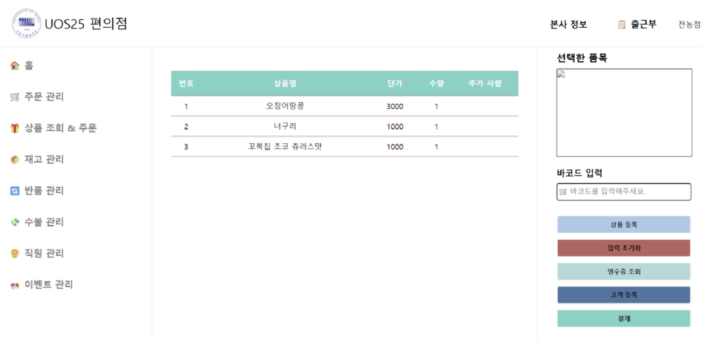
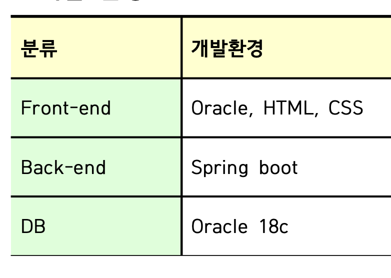
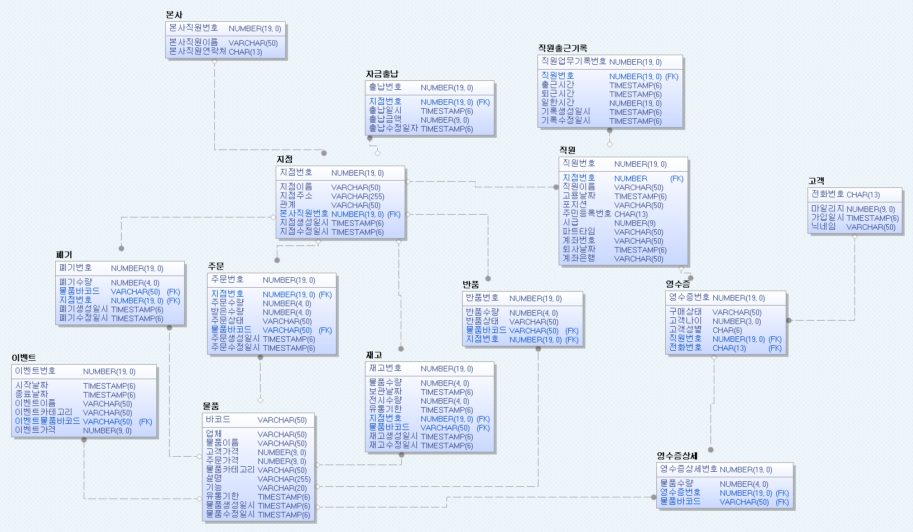

# UOS25 Back-End
UOS25 서울시립대학교 데이터베이스설계 수업 프로젝트로 편의점 시스템을 구현하는 프로젝트입니다.

---
## 개발 환경

---
## ERD

---
[문서 URL](./document/UOS25.pdf)
---
## 역할
| 이름                                   | 역할    |
|--------------------------------------|-------|
| [유현승](https://www.github.com/UDADDY) | 백엔드   |
| [김민서](https://github.com/ms9648)     | 프론트엔드 |
| [김성령](https://github.com/MTsauRus)     | 백엔드   | 
